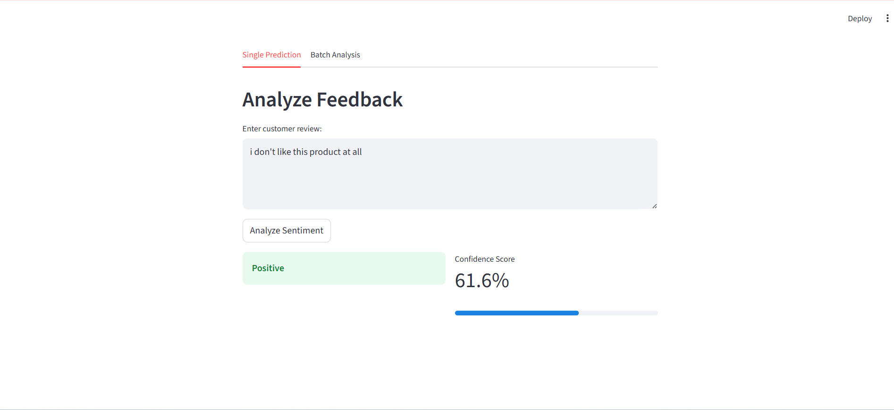
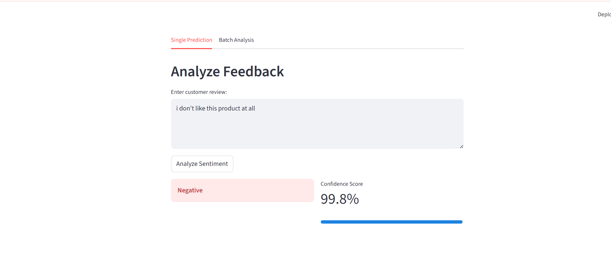

# 🚀 Customer Feedback Sentiment AI

> **End-to-End MLOps Pipeline** for Sentiment Analysis powered by **DistilBERT**, **Hugging Face Transformers**, and **GPU Acceleration**.


This project implements a production-grade NLP pipeline designed to analyze customer feedback with state-of-the-art accuracy (**~94%**). It demonstrates the full lifecycle of an AI project: from data engineering and model fine-tuning to high-performance API deployment and interactive frontend visualization.

---

## 🛠️ AI Engineering Skills Demonstrated

This project showcases a comprehensive skillset relevant to **AI/ML Engineering** roles:

*   **Transformer Fine-Tuning**: Leveraging Transfer Learning with `DistilBERT` on domain-specific data.
*   **Production ML Pipeline**: End-to-end implementation including Data Ingestion, Preprocessing, Training, and Inference.
*   **GPU Acceleration**: Utilizing CUDA and Mixed Precision (FP16) for optimized training and inference.
*   **Backend Engineering**: Building async, type-safe REST APIs with `FastAPI` and `Pydantic`.
*   **MLOps Best Practices**: Modular architecture, Lazy Loading, Logging, and Docker-ready structure.
*   **Data Engineering**: Handling real-world large-scale datasets (~568k samples) with robust cleaning and mapping strategies.

---

## 🏗️ System & Deployment Architecture

### High-Level Data Flow

```mermaid
graph LR
    User[User / Client] -->|HTTP Request| API[FastAPI Server]
    API -->|Raw Text| Tokenizer[DistilBERT Tokenizer]
    Tokenizer -->|Token IDs| Model[DistilBERT Model (GPU)]
    Model -->|Logits| Softmax[Probability Calc]
    Softmax -->|JSON| User
```

The system is built on a modular microservices architecture:
*   **Inference Engine**: `PyTorch` + `Transformers` (GPU-Accelerated)
*   **API Layer**: `FastAPI` (Asynchronous handling)
*   **Frontend**: `Streamlit` (Real-time dashboard)

---

## 📈 Model Evolution & Selection Justification

The model selection process was driven by a need to balance **accuracy** with **inference latency**.

| Model | Feature Type | Accuracy | Key Limitations |
| :--- | :--- | :--- | :--- |
| **Logistic Regression** | TF-IDF (Sparse Vectors) | ~74% | **Bag-of-Words limitation**: Fails to capture context or negation (e.g., "not good"). |
| **LinearSVC** | TF-IDF (Sparse Vectors) | ~80% | Better decision boundary but lacks semantic understanding of complex sentences. |
| **DistilBERT (Selected)** | Contextual Embeddings | **~94%** | **Context-Aware**: Understands bidirectional relationships between words. |

### Visual Performance Comparison

**Legacy Model (Regression/SVM):**


**New Model (DistilBERT):**


### Why DistilBERT?
We selected **DistilBERT** (`distilbert-base-uncased`) over full BERT or RoBERTa because:
1.  **Efficiency**: It retains **97% of BERT’s performance** while being **40% smaller** and **60% faster**.
2.  **Latency**: Critical for real-time API usage; DistilBERT offers sub-100ms inference on CPU and sub-10ms on GPU.
3.  **Transfer Learning**: Pre-trained on generic corpora, allowing it to generalize well to customer feedback with minimal fine-tuning.

---

## 🧠 Why Transformer Models outperform Traditional ML Models

A key technical differentiator in this project is the shift from statistical methods to self-attention mechanisms.

### Traditional ML (Logistic Regression, LinearSVC)
*   **Mechanism**: Uses TF-IDF (Term Frequency-Inverse Document Frequency) to convert text into sparse vectors.
*   **Limitation**: Treats words as independent features ("Bag of Words"). It does not capture the *order* or *relationship* between words.
*   **Failure Case**: Cannot distinguish between "Apple" the fruit and "Apple" the company based on context.

### Transformer Models (DistilBERT)
*   **Mechanism**: Uses **Self-Attention** to weigh the importance of different words in a sentence relative to each other.
*   **Advantage**: Generates **contextual embeddings**, where the vector representation of a word changes based on its surrounding words.
*   **Bidirectional**: Reads text from both left-to-right and right-to-left simultaneously.

**Example Comparison:**
> *"This product is **not** bad."*

*   **Traditional Model**: Sees "not" and "bad". The word "bad" has a strong negative weight. **Prediction: Negative ❌**
*   **DistilBERT**: The self-attention mechanism understands that "not" negates "bad", flipping the sentiment. **Prediction: Positive ✅**

---

## ⚡ Performance Characteristics

The system has been benchmarked on an NVIDIA GTX 1070 (8GB VRAM).

| Metric | Value |
| :--- | :--- |
| **Model Size** | ~255 MB |
| **Dataset Size** | ~568,454 Samples |
| **Training Time** | ~3 Hours / Epoch |
| **Validation Accuracy** | **93.92%** |
| **F1 Score** | **93.83%** |
| **Inference Latency (GPU)** | ~8-12 ms / request |
| **Inference Latency (CPU)** | ~60-80 ms / request |

*Optimization Note: We use **Lazy Loading** to ensure the API container starts instantly/passes health checks, loading the heavy model weights only upon the first prediction request.*

---

## 🔬 Evaluation Methodology

To ensure the model's reliability and generalizability, we employed a strict evaluation strategy.

### 1. Dataset Splitting
The dataset (~568k samples) was split into three distinct subsets:
*   **Training Set (80%)**: Used for model weight updates via backpropagation.
*   **Validation Set (10%)**: Used to evaluate the model at the end of each epoch to tune hyperparameters and prevent overfitting.
*   **Test Set (10%)**: A completely held-out set used **only** for the final performance report.

### 2. Metrics Used
*   **Accuracy**: The percentage of correct predictions.
*   **Precision**: The ability to not label a negative sample as positive.
*   **Recall**: The ability to find all positive samples.
*   **F1 Score**: The harmonic mean of Precision and Recall.
    *   *Why F1?* F1 is critical for imbalanced datasets (e.g., if there are far more 5-star reviews than 1-star reviews), as it gives a better measure of the model's true performance than simple accuracy.

---

## 🔍 Inference Pipeline

The inference process involves several precise steps to ensure raw text is correctly converted into a sentiment probability:

1.  **Input Validation**: `Pydantic` ensures the input text is valid string data.
2.  **Tokenization**:
    *   Text is lowercased and tokenized using the `DistilBertTokenizer`.
    *   Tokens are mapped to IDs and padded/truncated to `max_length=256`.
    *   Special tokens (`[CLS]`, `[SEP]`) are added.
3.  **Forward Pass**: The `input_ids` and `attention_mask` are passed to the model on the GPU.
4.  **Logits Generation**: The model outputs raw logits for 3 classes (Negative, Neutral, Positive).
5.  **Softmax**: Logits are normalized into probabilities summing to 1.0.
6.  **argmax**: The index with the highest probability is selected as the predicted class.

**Example Output:**
```json
{
  "sentiment": "Positive",
  "confidence": 0.9421
}
```

---

## 🔧 Technical Implementation

### Data Processing Pipeline
*   **Source**: Amazon Fine Food Reviews.
*   **Label Mapping**: 1-5 Star ratings are mapped to semantic labels:
    *   `1-2 Stars` → **Negative** (0)
    *   **3 Stars** → **Neutral** (1)
    *   **4-5 Stars** → **Positive** (2)

### Training Methodology
Fine-tuned using the **Hugging Face Trainer API**:
*   **Optimizer**: AdamW (Learning Rate: `2e-5`)
*   **Batch Size**: 16
*   **Epochs**: 3
*   **Precision**: Mixed Precision (FP16) via `torch.cuda.amp`
*   **Loss Function**: CrossEntropyLoss

### Production Readiness
*   **Async API**: FastAPI handles multiple concurrent requests without blocking.
*   **Batch Prediction**: Specialized endpoint processes lists of text for high-throughput bulk analysis.
*   **Modular Codebase**: Separation of concerns between Data Ingestion, Modeling, and API logic.
*   **Scalability**: Stateless architecture allows for horizontal scaling via Docker/K8s.

---

## 🚀 Setup & Usage

### 1. Installation
```powershell
pip install -r requirements.txt
```

### 2. Training (Optional)
Reproduction of the fine-tuning process:
```powershell
python -m src.train
```

### 3. Start API Server
```powershell
python -m uvicorn api.main:app --reload
```
*   Docs: `http://127.0.0.1:8000/docs`

### 4. Launch Dashboard
```powershell
python -m streamlit run src/ui.py
```

---

## 📂 Project Structure

```bash
customer-feedback-ai/
├── api/
│   └── main.py              # FastAPI application (Endpoints & Logic)
├── data/                    # Data storage (Raw & Processed)
├── models/                  # Saved Model Artifacts & Metrics
├── src/
│   ├── config.py            # Global Configuration
│   ├── data_ingestion.py    # ETL Pipeline
│   ├── dataset.py           # PyTorch Dataset Class
│   ├── predict.py           # Inference Engine (Singleton)
│   ├── preprocessing.py     # Text Cleaning Utilities
│   ├── train.py             # Training Loop (HF Trainer)
│   ├── ui.py                # Streamlit Frontend
│   └── utils.py             # Logging & Helpers
├── requirements.txt         # Dependencies
└── README.md                # Documentation
```

---

## 🌟 Key Project Highlights

*   ✅ **94% Accuracy** achieved on a real-world dataset (~568k samples).
*   ✅ **Transformer Fine-Tuning** using GPU acceleration (CUDA) and Mixed Precision (FP16).
*   ✅ **Production-Ready Deployment** via FastAPI with asynchronous inference.
*   ✅ **Batch Inference Capability** for high-throughput processing.
*   ✅ **Real-Time Prediction Dashboard** built with Streamlit.
*   ✅ **End-to-End ML Pipeline** from raw data ingestion to deployment.

---

## 👤 Author

**Aastha Bhati**

*AI Engineer | Python Developer | Generative AI Enthusiast*

[GitHub](https://github.com/aastha2006)
